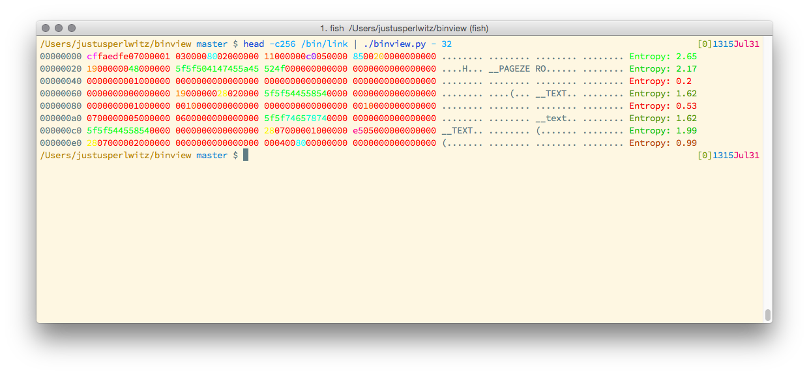

# Binview
Visualize binary files.



## Installation
```
pip3 install binview
```

## Show Hexdump + Entropy
```
bash-3.2$ binview/binview.py /bin/link | head
00000000 cffa edfe 0700 0001 0300 0080 0200 0000 ................ H: 2.77
00000010 1100 0000 c005 0000 8500 2000 0000 0000 ................ H: 1.62
00000020 1900 0000 4800 0000 5f5f 5041 4745 5a45 ....H...__PAGEZE H: 2.78
00000030 524f 0000 0000 0000 0000 0000 0000 0000 RO.............. H: 0.67
00000040 0000 0000 0100 0000 0000 0000 0000 0000 ................ H: 0.34
00000050 0000 0000 0000 0000 0000 0000 0000 0000 ................ H: 0.00
00000060 0000 0000 0000 0000 1900 0000 2802 0000 ............(... H: 0.99
00000070 5f5f 5445 5854 0000 0000 0000 0000 0000 __TEXT.......... H: 1.67
00000080 0000 0000 0100 0000 0010 0000 0000 0000 ................ H: 0.67
00000090 0000 0000 0000 0000 0010 0000 0000 0000 ................ H: 0.34
```

## Show Histogram
```
bash-3.2$ binview/binview.py /bin/link -i
Byte Count
00 (b'\x00') 7687
01 (b'\x01') 287
ff (b'\xff') 186
74 (t) 174
5f (_) 172
20 (b' ') 153
65 (e) 149
...
7d (}) 2
e1 (b'\xe1') 2
Ea (b'\xea') 2
```

## Show entropy distribution
```
bash-3.2$ binview/binview.py /bin/link -e
00000000 2.77
00000200 1.62
00000400 2.78
00000600 0.67
00000800 0.34
00000a00 0.00
00000c00 0.99
...
00074800 0.00
00074a00 0.00
00074c00 0.00
```

## Show autocorrelation
```
bash-3.2$ binview/binview.py /var/log/wifi.log -a
Potential periodicity: 42 bytes
Offset Content
000 b'Fri Oct 17'... (comparison)
02a b'Fri Oct 17'...
003 b' Oct 17 16'...
02d b' Oct 17 16'...
004 b'Oct 17 16:'...
```
